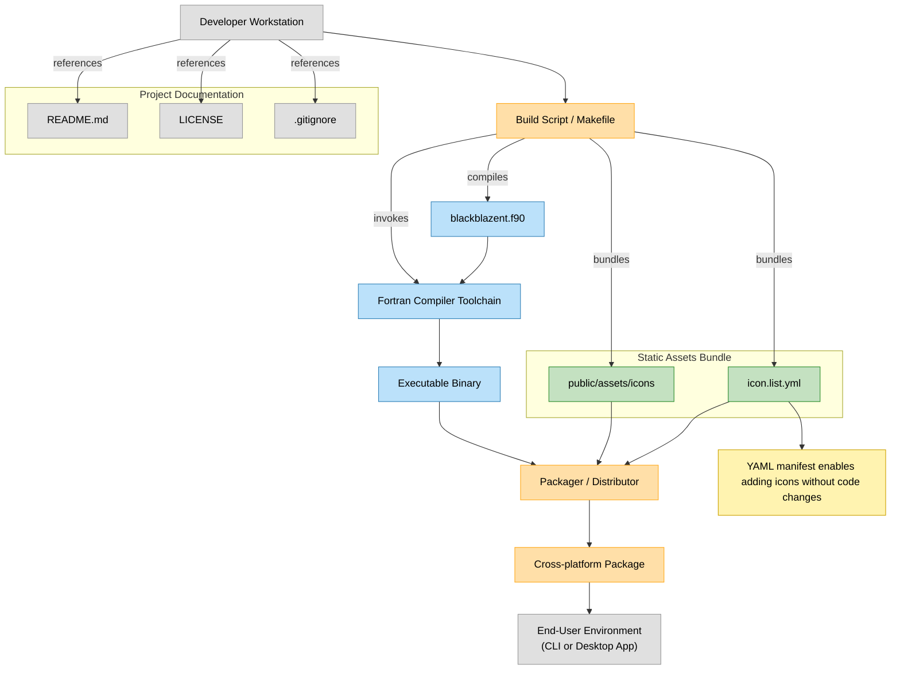

# 🔹 Welcome to BlackBlazent

**BlackBlazent** is an independent software organization creating hybrid, cross-platform apps — designed with passion, purpose, and precision.

---

## 🚀 About Us

We are a startup software company focused on building modern, user-centered digital tools. From music and video apps to creative galleries, we aim to make hybrid apps accessible and meaningful.

---

## 🎯 Our Application Goals

Every application created under **BlackBlazent** is built with a clear purpose. We focus on solving real-world problems through hybrid technology, beautiful design, and intuitive user experience.

### 🌟 Core Goals Behind Our Apps

1.  
    ✅ **Cross-Platform Experience**  
    Deliver seamless functionality on desktop, web, and mobile environments.

2.  
    🎨 **Creative & Visual Engagement**  
    Prioritize visually rich interfaces that are easy and enjoyable to use.

3.  
    ⚙️ **Practical Functionality**  
    Build tools that support daily productivity, entertainment, and creativity.

4.  
    📱 **Hybrid Technology Stack**  
    Use modern hybrid frameworks to ensure faster development and wider reach.

5.  
    🔐 **User-First Design**  
    Respect user privacy, simplicity, and accessibility in all features.

6.  
    🌍 **Global Accessibility**  
    Design apps that can be localized and enjoyed by users around the world.

---

> 🧭 Our mission is to build purposeful digital tools that blend art, function, and future-ready tech.
---

## 📦 Featured Projects

| Icon | Project Name | Description | Version | Tech Stack |
|------|--------------|-------------|---------|------------|
|  | [BlackMusic](https://github.com/BlackBlazent/BlackMusic.git) | Music Ultra Superior Integrated Catalog. A music player designed to deliver an unparalleled audio experience. BlackMusic integrates a vast catalog of music with superior playback capabilities. | v1.1.01.001.0001 | Undisclosed |
|  | [BlackVideo](https://github.com/BlackBlazent/BlackVideo.git) | BlackVideo - Black : Versatile Integrated Demi Empowerment Optimum—Player. A video player with integration of wide variety of playback functionalities. | v1.0.0 | Undisclosed |
|  | [BlackGallery](https://github.com/BlackBlazent/BlackGallery.git) | A comprehensive and innovative gallery app designed to showcase and organize your visual content in the most efficient and appealing way possible. With a focus on delivering a luminous and vibrant display, it serves as a library for your images, providing an extensive collection of features to enhance your viewing experience. | v1.0.0 | Undisclosed |
|  | [BlackMiscellen](https://github.com/BlackBlazent/BlackMiscellen.git) | An Integrated Miscellaneous tools. | v1.0.0 | Undisclosed |

---

# Diagram

## 👤 Join or Follow Us

We’re always open to contributors, testers, and idea sharers!  

### 🔧 General & Administrative

| Purpose                               | Given Email                                                |
| ------------------------------------- | -------------------------------------------------------------- |
| **Main** | `blackblazent@gmail.com`                                      |
| **Customer Support**                  | `blackblazent.customer.service@gmail.com`                     |
| **Billing & Payments**                | `blackblazent.billing@gmail.com` |
| **Legal or Compliance**               | `blackblazent.legal@gmail.com`     |
| **General Inquiries**                 | `blackblazent.info@gmail.com`       |

---

### 🧑‍💻 Development & Technical

| Purpose                            | Given Email                                                         |
| ---------------------------------- | ----------------------------------------------------------------------- |
| **Developer Support**              | `blackblazent.dev@gmail.com`                  |
| **Technical Issues / Bug Reports** | `blackblazent.techsupport@gmail.com` |

---

### 📣 Marketing & Outreach

| Purpose                           | Given Email                                                    |
| --------------------------------- | ------------------------------------------------------------------ |
| **Marketing Team**                | `blackblazent.marketing@gmail.com` |
| **Partnerships / Collaborations** | `blackblazent.partners@gmail.com`   |
| **Press / Media Inquiries**       | `blackblazent.press@gmail.com`         |

---

### 🧪 Product & Feedback

| Purpose                             | Given Email                                                  |
| ----------------------------------- | ---------------------------------------------------------------- |
| **Product Feedback**                | `blackblazent.feedback@gmail.com` |
| **Beta Testers / Test Environment** | `blackblazent.beta@gmail.com`         |

---

> 🖤 Made with code and creativity by BlackBlazent
